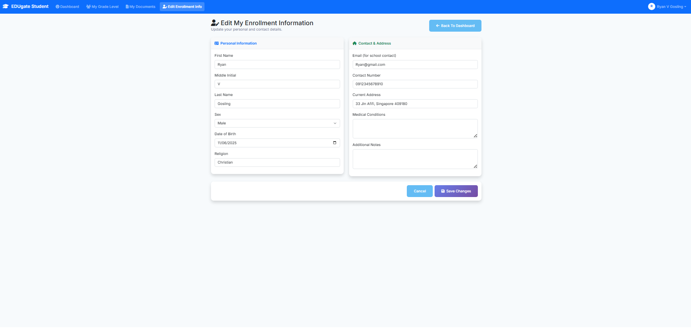
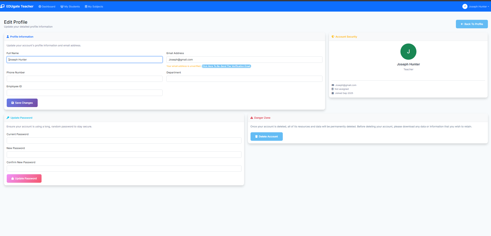
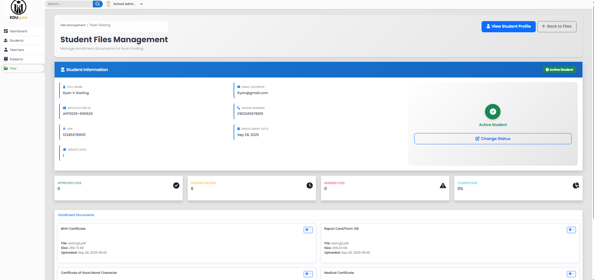

# 🎓 School Management System (Laravel)

<div align="center">


**A comprehensive school management system built with Laravel 12, featuring multi-role authentication, student enrollment, teacher management, file handling, and advanced analytics dashboard.**

[Features](#-features) • [Installation](#-installation) • [Usage](#-usage) • [Screenshots](#-screenshots)

</div>

## 🎯 Overview

The School Management System is a modern, web-based application designed to streamline educational institution operations. Built with Laravel 12, it provides a comprehensive solution for managing students, teachers, subjects, and administrative tasks with role-based access control and advanced analytics.

### Key Highlights

- **Multi-Role Authentication System** - Admin, Teacher, Student, Owner, and Staff roles
- **Public Student Enrollment** - Online enrollment system with file upload capabilities
- **Advanced Analytics Dashboard** - Real-time statistics and data visualization
- **File Management System** - Secure document handling for students and teachers
- **Responsive Design** - Modern UI with Tailwind CSS and Alpine.js
- **RESTful API** - Complete API endpoints for mobile app integration

---

## 📸 Screenshots

### 🏠 Main Pages

#### Homepage


#### Login Page


#### Enrollment Page


#### Check Status Page


### 👨‍💼 Admin Dashboard

#### Admin Dashboard


#### Student Management





#### Teacher Management



#### Subject Management


#### File Management


### 👨‍🏫 Teacher Dashboard

#### Teacher Dashboard


#### Teacher Student Management


#### Teacher Subject Management


### 👨‍🎓 Student Dashboard

#### Student Dashboard


#### Student File Management


### 🔐 Authentication & Security

#### Forgot Password


---

## ✨ Features

### 🔐 Authentication & Authorization
- **Multi-role authentication** with Laravel Breeze
- **Role-based access control** (Admin, Teacher, Student, Owner, Staff)
- **Email verification** for new accounts
- **Password reset** functionality
- **Session management** with remember me option

### 👥 User Management
- **Student Management**
  - Complete student profiles with personal and academic information
  - Enrollment status tracking (Active, Enrolled, Graduated, Dropped)
  - LRN (Learner Reference Number) management
  - Parent/Guardian information storage
  - Medical conditions and special needs tracking

- **Teacher Management**
  - Teacher profiles with educational background
  - Subject assignment capabilities
  - Profile picture management
  - Status tracking (Active, Inactive, On Leave)

- **Admin Management**
  - Administrative user accounts
  - System configuration access
  - User role management

### 📚 Academic Management
- **Subject Management**
  - Create and manage academic subjects
  - Subject code and description tracking
  - Grade level associations

- **Enrollment System**
  - Public enrollment form with validation
  - Application ID generation
  - Document requirement tracking
  - Status management workflow

### 📊 Analytics & Reporting
- **Dashboard Analytics**
  - Real-time statistics (Students, Teachers, Subjects, Users)
  - Monthly enrollment trends (Line Chart)
  - Student status distribution (Doughnut Chart)
  - Grade level distribution (Bar Chart)
  - Graduation trends over 5 years

- **File Management Statistics**
  - Document upload tracking
  - File status monitoring
  - Category-based file organization

### 📁 File Management System
- **Student Files**
  - Required document types (Birth Certificate, Report Card, etc.)
  - Secure file upload and storage
  - File status tracking (Pending, Approved, Rejected)
  - Document preview and download

- **Teacher Files**
  - Lesson plans and educational resources
  - Certificates and credentials
  - Photo management
  - Category-based organization

### 🎨 User Interface
- **Responsive Design** - Mobile-first approach with Tailwind CSS
- **Modern UI Components** - Clean, intuitive interface design
- **Interactive Dashboards** - Real-time data visualization with Chart.js
- **Alpine.js Integration** - Dynamic frontend interactions

---

## 🛠 Technology Stack

### Backend
- **Laravel 12.x** - PHP web framework
- **PHP 8.2+** - Server-side programming language
- **SQLite** - Database (configurable for MySQL/PostgreSQL)
- **Laravel Breeze** - Authentication scaffolding
- **Spatie Laravel Permission** - Role and permission management
- **Intervention Image** - Image processing and manipulation

### Frontend
- **Tailwind CSS 3.x** - Utility-first CSS framework
- **Alpine.js 3.x** - Lightweight JavaScript framework
- **Chart.js** - Data visualization library
- **Vite** - Modern build tool and development server
- **Axios** - HTTP client for API requests

### Development Tools
- **Composer** - PHP dependency management
- **NPM** - Node.js package management
- **Laravel Pint** - Code style fixer
- **PHPUnit** - Testing framework
- **Laravel Pail** - Log monitoring

---

## 🚀 Quick Start

### Prerequisites
- PHP 8.2+
- Composer
- Node.js 18+
- Git

### Installation

```bash
# Clone the repository
git clone https://github.com/AJken1/school-edu-laravel.git
cd school-edu-laravel

# Install dependencies
composer install
npm install

# Environment setup
cp .env.example .env
php artisan key:generate

# Database setup
touch database/database.sqlite
php artisan migrate
php artisan db:seed

# Build assets
npm run build

# Start server
php artisan serve
```

### Default Login Credentials

| Role | Email | Password |
|------|-------|----------|
| Admin | admin@school.local | 123123123 |

---

## 📱 Usage

### Getting Started

1. **Access the Application**
   - Open your browser and navigate to `http://localhost:8000`
   - You'll see the public homepage with enrollment options

2. **Login to Admin Panel**
   - Click "Login" in the navigation
   - Use admin credentials: `admin@school.local` / `123123123`
   - You'll be redirected to the admin dashboard

3. **Explore the Dashboard**
   - View real-time statistics
   - Access different management sections
   - Switch between light/dark themes

### Student Enrollment Process

1. **Public Enrollment**
   - Visit the homepage
   - Click "Enroll Now"
   - Fill out the enrollment form
   - Upload required documents
   - Submit for review

2. **Admin Review**
   - Admin reviews submitted applications
   - Approves or rejects based on documents
   - Updates student status accordingly

### File Management

1. **Student Files**
   - Students can upload required documents
   - Admins can review and approve files
   - Track file status and requirements

2. **Teacher Files**
   - Teachers can upload lesson plans and resources
   - Organize files by categories
   - Manage personal documents

### Analytics Dashboard

1. **View Statistics**
   - Real-time counts of users and entities
   - Interactive charts and graphs
   - Export capabilities for reports

2. **Monitor Trends**
   - Monthly enrollment patterns
   - Grade level distributions
   - Graduation trends over time

---

## 🔌 API Documentation

### Authentication Endpoints

```http
POST /api/login
Content-Type: application/json

{
    "email": "admin@gmail.com",
    "password": "123"
}
```

### Student Management

```http
# Get all students
GET /api/students

# Get specific student
GET /api/students/{id}

# Create new student
POST /api/students
Content-Type: application/json

{
    "firstname": "John",
    "lastname": "Doe",
    "email": "john.doe@example.com",
    "grade": "10"
}
```

### File Management

```http
# Upload student file
POST /api/students/{id}/files
Content-Type: multipart/form-data

{
    "file_type": "birth_certificate",
    "file": [file]
}
```

### Dashboard Statistics

```http
# Get dashboard statistics
GET /api/dashboard/stats

# Response
{
    "studentCount": 150,
    "teacherCount": 25,
    "subjectCount": 12,
    "adminCount": 5
}
```

---

## 🗄️ Database Schema

### Core Tables

#### Users Table
```sql
- id (Primary Key)
- user_id (Unique Identifier)
- employee_id (Unique)
- name
- email (Unique)
- password (Hashed)
- role (admin, teacher, student, owner, staff)
- phone
- department
- status (active, inactive, pending)
- theme (light, dark)
- email_verified_at
- created_at
- updated_at
```

#### Students Table
```sql
- id (Primary Key)
- application_id (Unique)
- school_year
- lrn_number (Unique)
- firstname, lastname, mi
- email, phone, contact_number
- sex, gender, date_of_birth
- religion, current_address
- grade, grade_level
- parent_name, parent_phone, parent_email
- relationship (father, mother, guardian, other)
- father_firstname, father_lastname, father_mi
- mother_firstname, mother_lastname, mother_mi
- guardian_firstname, guardian_lastname, guardian_mi
- medical_conditions, additional_notes
- status (Active, Enrolled, Graduated, Dropped)
- user_id (Foreign Key)
- created_at, updated_at
```

#### Teachers Table
```sql
- id (Primary Key)
- teacher_id (Unique)
- fname, lname, mi
- dob, phone, gender
- address, specialization
- education_background
- profile_picture
- status (Active, Inactive, On Leave)
- user_id (Foreign Key)
- created_at, updated_at
```

#### Subjects Table
```sql
- id (Primary Key)
- subject_code (Unique)
- subject_name
- description
- grade_level
- created_at, updated_at
```

### File Management Tables

#### Student Files Table
```sql
- id (Primary Key)
- student_id (Foreign Key)
- file_type (birth_certificate, report_card, etc.)
- file_name
- file_path
- file_size
- mime_type
- status (Pending, Approved, Rejected)
- uploaded_at
- created_at, updated_at
```

#### Teacher Files Table
```sql
- id (Primary Key)
- teacher_id (Foreign Key)
- category (lesson_plan, resource, certificate, etc.)
- file_name
- file_path
- file_size
- mime_type
- description
- status (Active, Inactive)
- created_at, updated_at
```

---

## 📁 File Structure
